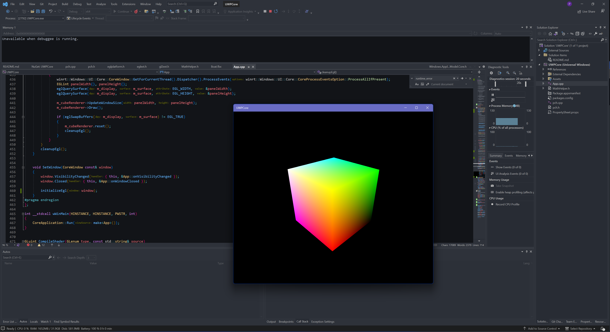
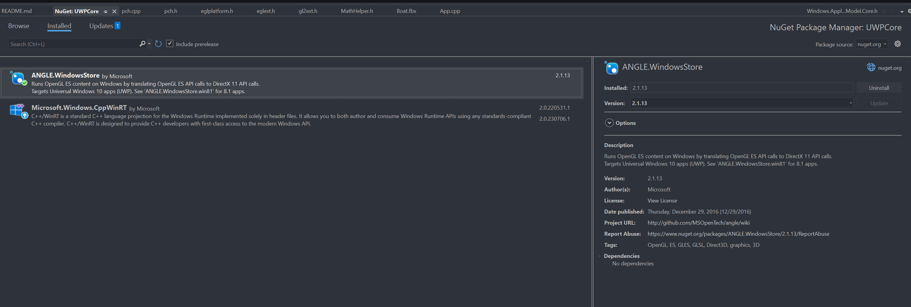

# UWP with Angle
This project acts as a template to bring back [Angle](https://github.com/google/angle) with UWP. So you can write OpenGL ES code in UWP.

## Build
Do absolutely nothing. Use Visual Studio with C++ UWP development workflow, just clone and run.

## Dependencies
Are managed by **Nuget** so it should be automatically installed. If not, blame Microsoft.

## Screenshots

